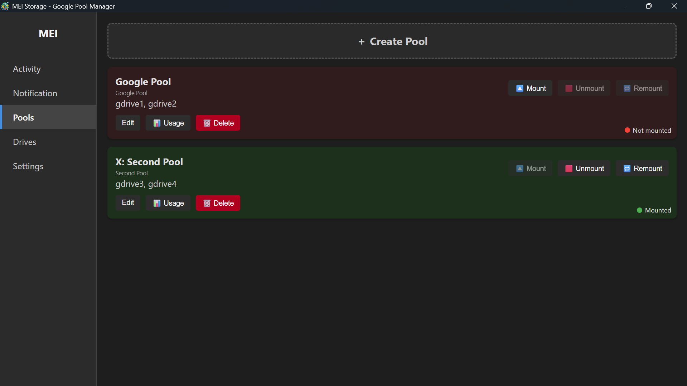
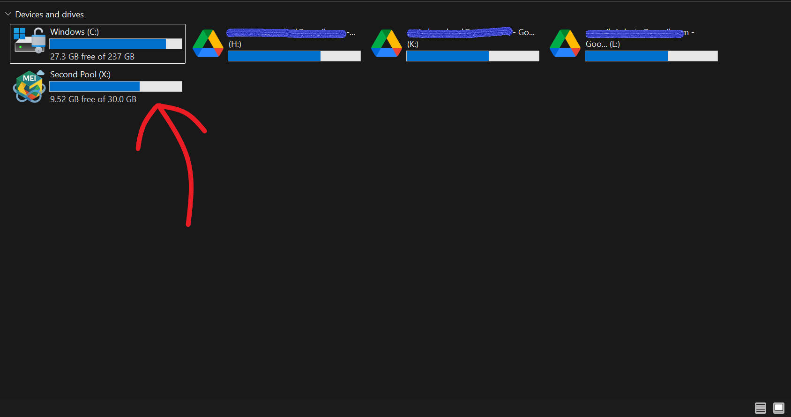
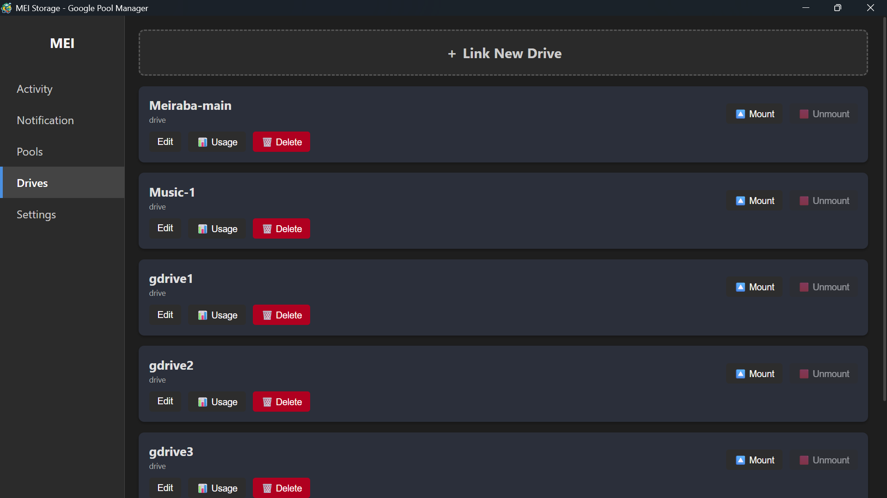
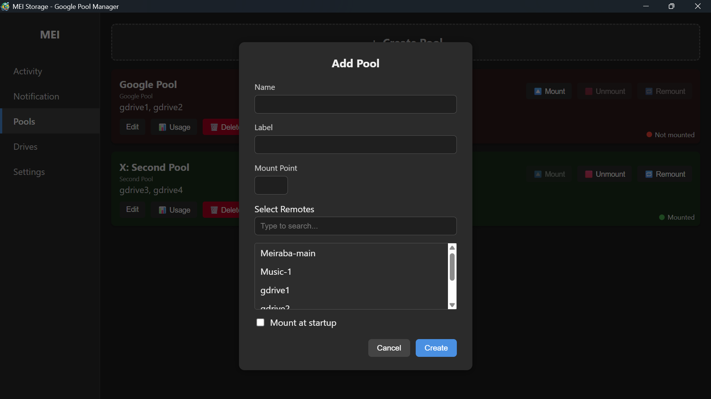
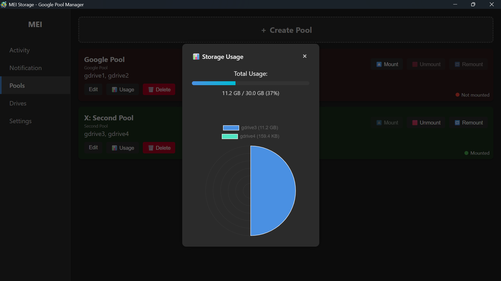
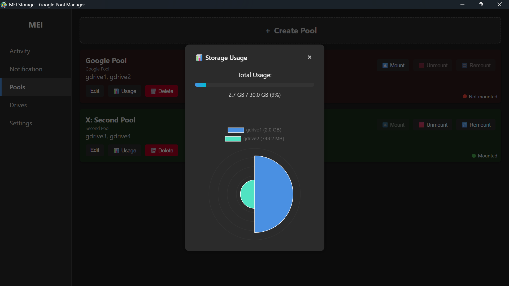
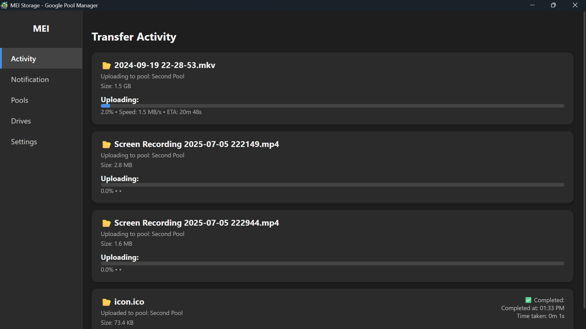

# 🗂️ MEI Storage

A modern Electron-based desktop app to manage Google Drive remotes and Rclone pools with a sleek dark UI — no terminal needed.

(it can manage any drive supported by rclone)
> YOU NEED [WINFSP](https://winfsp.dev/rel/) TO WORK
---
<p align="center">
  
  
</p>

### v2.5.0-beta.1
- Custom drive icon
- Mount health monitoring
- Added notification for: lost connection, mount failed
- Added authorized rclone remote control
- Bug fixes: activity showing downloads, unable to edit mountpoint ,etc..

## 🚀 Features

- 🔐 Seamlessly add new Google Drives with OAuth
- 🧩 Create & manage union-based Drive Pools
- 🖱️ One-click Mount / Unmount / Remount
- 📊 Visual Drive & Pool Usage Statistics
- 🧠 Runs in the system tray with startup mount support
- 📡 Live Transfer Activity Monitor
- 💾 Persistent settings and remotes


---
## 🛠️ Upcoming Features

- 🔔 In-app Notifications
- ❗ Better Error Reporting and Feedback
- 🔍 Mount Detection and Health Monitoring
- 🖌️ Custom Icon for each drive
- empty trash
- move/copy file (remote to remote)
- advance config
- encryption
- google photo
- Sync, include winfsp

## 📥 How to Download

### ✅ Option 1: Download `.exe`

- Go to the [Releases](https://github.com/LMeiraba/mei-storage/releases) page.
- Download:  
  **`MEI Storage Setup x.x.x.exe`** *(installer)*  
  
> The setup version supports autostart and creates a Start Menu shortcut.

---

### 🧪 Option 2: Run from Source

```bash
git clone https://github.com/LMeiraba/mei-storage.git
cd mei-storage
npm install
npm start
```
> Make sure Node.js is installed.
Rclone binary must be present at bin/rclone.exe.

### 🏗️ Build Locally
```bash
npm run dist
```
This will generate:

- `dist/MEI Storage Setup X.X.X.exe` — Installer with Start Menu/Desktop support

> Make sure `bin/rclone.exe` exists and `icon.ico` is valid.

## 🖼️ More ScreenShots








### 💬 Discord

[https://discord.gg/invite/Eyvkfhm5N7](https://discord.gg/invite/Eyvkfhm5N7)